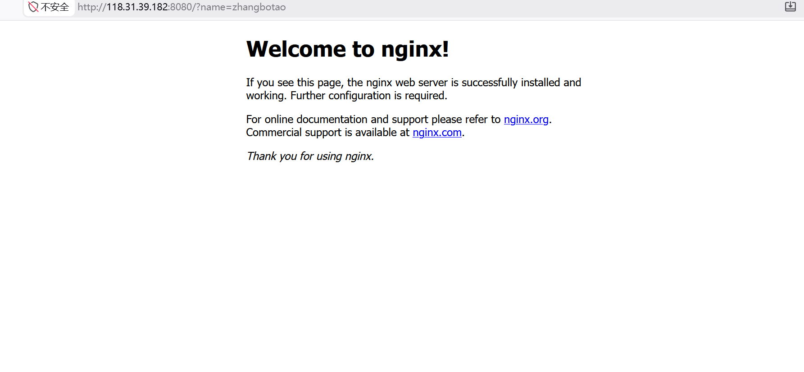
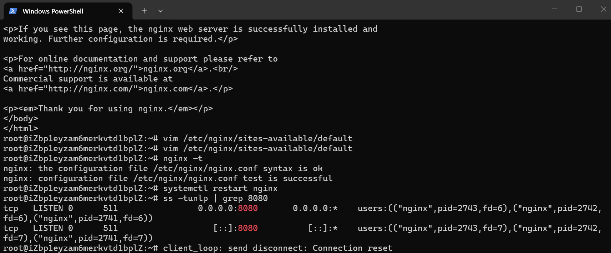

# linux-web-deploy-practice
我的第一个云上部署项目
项目截图

# 浏览器访问验证

# 终端端口监听验证

# Linux Web 服务部署与排障实战

> 我的第一个云上部署项目

## 项目简介
在阿里云 ECS（Ubuntu 22.04）上从零部署 Nginx，修改默认端口为 8080，配置安全组实现公网访问，并完成一次完整的配置修改与排障过程。

## 技术栈
- **云平台**：
- 阿里云 ECS
- **操作系统**：Ubuntu 22.04 LTS
- **Web 服务**：Nginx
- **管理工具**：SSH、systemctl、vim

## 项目截图

### 浏览器访问验证（带个人参数）

### 终端端口监听验证

## 核心操作步骤

### 1. 服务器准备
- 申请阿里云 ECS 实例（Ubuntu 22.04）
- 安全组放行 22（SSH）和 8080 端口

### 2. 连接服务器
ssh root@你的公网IP
### 3. 安装 Nginx
apt update 更新软件列表
apt install nginx -y安装nginx

### 4. 修改默认端口（80 → 8080）
vim /etc/nginx/sites-available/default编辑配置文件
将 listen 80 改为 listen 8080
### 5. 验证配置并重启
nginx -t测试配置语法
systemctl restart nginx重启服务
ss -tunlp | grep 8080查看监听端口

### 6. 公网访问测试
浏览器访问：http://你的公网IP:8080/?name=zhangbotao

### 踩坑记录
1：SSH 连接被拒绝
    现象：Permission denied (publickey)
    原因：免费试用实例默认禁用密码登录
    解决：在阿里云控制台重置密码并强制重启
2：浏览器访问超时
    现象：访问 http://IP:8080 一直转圈
    原因：安全组未放行 8080 端口
    解决：添加入方向规则 TCP 8080/8080，授权 0.0.0.0/0
    总结

### 通过这个项目，我掌握了：
    云服务器的申请与配置
    SSH 远程管理 Linux 服务器
    Linux 下部署 Web 服务
    服务配置修改与排障
    云平台安全组配置
    从公网访问自己部署的服务
